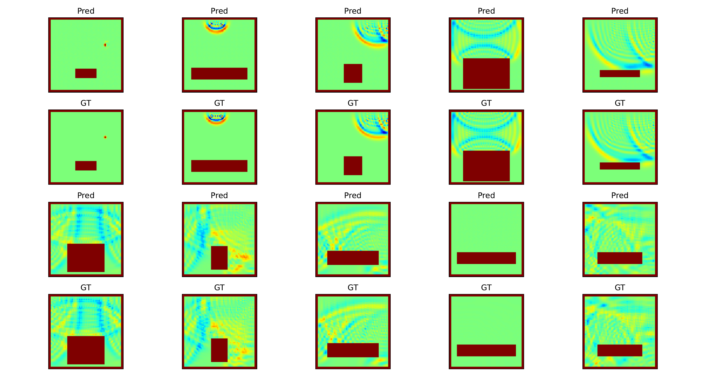

# SoundField predicting with Flow Matching

## Acknowledgement & Source Information

This project is developed based on the open-source project by [qiuqiangkong](https://github.com/qiuqiangkong/audio_flow/tree/main ). Special thanks for their valuable work.

### Key Modifications:
- Added module of SoundFiled predicting

## Train

```python
CUDA_VISIBLE_DEVICES=0 python3 train.py --config="./configs/boundary2field.yaml"
```

## Results

Here are the results after training with a single RTX 4090 GPU for 8 hours (200k steps). Users can achieve better performance with longer training times.




## Cite

```bibtex
@misc{audioflow2025,
  author       = {Qiuqiang Kong},
  title        = {AudioFlow},
  year         = {2025},
  howpublished = {\url{https://github.com/qiuqiangkong/audio_flow}},
}
```

## External links

[1] Conditional flow matching: https://github.com/atong01/conditional-flow-matching

[2] DiT: https://github.com/facebookresearch/DiT